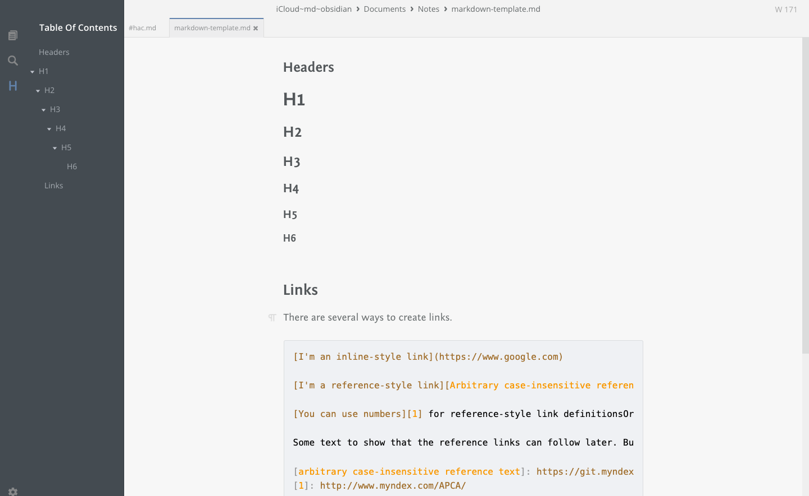

+++
title = "MarkText: an honest as they come markdown editor"
description = "MarkText is a markdown editor that’s packed with features. It’s flexible enough to make set up as easy as pressing a number of quick keys"
date = 2024-10-19
[taxonomies]
tags = ["markdown", "MarkText"]
+++

<figure>
        
        <figcaption>MarkText offers a clean, simple interface that you can hide with the flick of a quick key, and its free for use on Mac, Windows and Linux devices</figcaption>
</figure>

MarkText is a markdown editor, not unlike Ulysses, IA Writer and Bear. But unlike Ulysses, IA Writer and Bear, and many others I could name, MarkText is a free open source project. It’s available from [Github](https://github.com/marktext/marktext#download-and-installation). You can download a disk image, same as you would for most apps, or you can install it using Homebrew. That’s up to you.

Once you have it up and running, head over to Settings and there are a few adjustments you might like to make. Under the General settings, scroll down and set the default folder for your notes. That way you won’t be confronted by a blank screen every time you launch MarkText. Of course, some may prefer to leave it as is.

Under the Editor section in Settings, change the font family, font size, line height and the width of the text editor to suit (I prefer 18px/1.6 by 640px, but then I am getting on a bit), adjust the auto-completion of brackets and markdown styles, and refine the code block settings and tab spacings to your liking.

There are also various settings you can adjust under markdown, themes, spelling, images and keybindings. 

Explore your options in the top menu, but there are a few things worth pointing out. Export, under the File menu, allows you to produce a PDF or HTML document. You can also use ‘Save As’ an alternative file format, including `.txt`. I have not tested for other formats.

Under the View menu, you have Source, Typewriter and Focus, which are various modes you can switch on and off as needed. There are also options to hide the tabs, which appear at the top of your screen, and adjust the visibility of the sidebar and content bar, which appear at the left of your workspace. You can toggle these on and off to suit your work style.

Under the Paragraph menu, as well as the usual items you’ll find the ability to add Tables, Code, HTML, Quote and Math blocks, along with their respective shortcut keys. There’s also a useful feature to add a Task List to a document. Go ahead and add a list of tasks, then watch them grey out as you complete each one. Personally, I would have preferred them to strikethrough once completed, but each to their own.

MarkText, with a few adjustments, has all the presence of IA Writer and none of the ‘one-size-fits-all’ attitude that comes with that particular markdown app. In other words, there’s no dictating: ‘You should work like this; we know what’s best for you’. 

What it lacks is a number of features available in other apps, such as the ability to link documents, as in Obsidian, or Ullysses’ option to ‘stitch’ a series of documents together. That said, you can link documents of a fashion by providing folders. Or you may not care about features like that. Bear is another nice app, albeit with a proprietary format that locks your documents in, but nice apps don’t work for me. MartText does.

