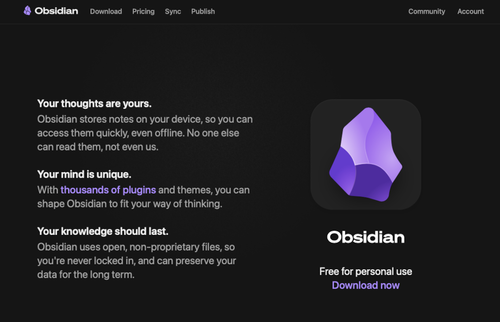
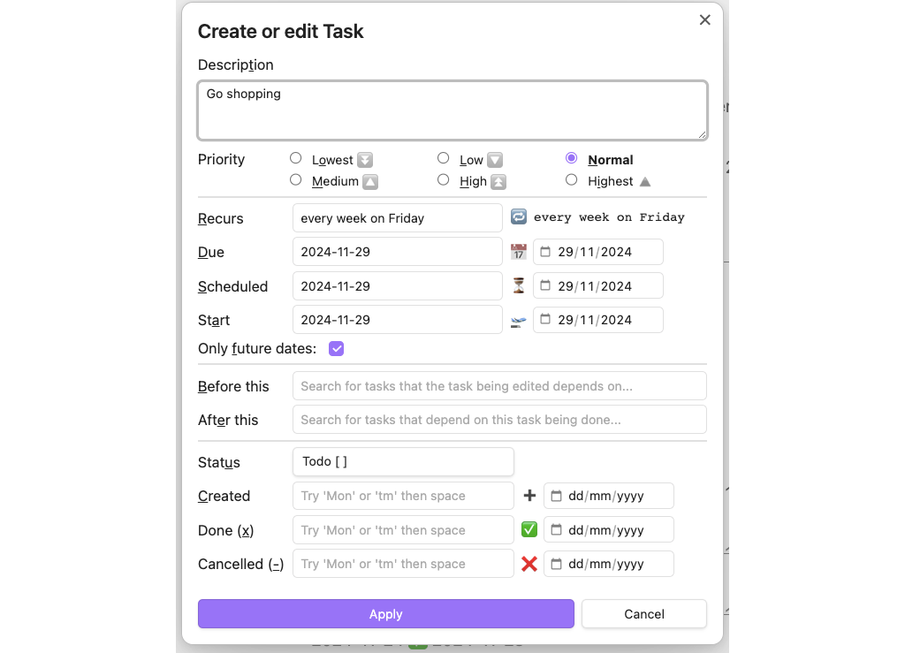

+++
title = "Using Obsidian as a task manager"
description = "Obsidian is a great note-taking app. Here’s how to make it a great task manager, too"
date = 2024-11-26
[taxonomies]
tags = ["obsidian", "task managers"]
+++

<figure>
        
        <figcaption>Obsidian is a great note-taking app, but is also a great way to manage your tasks</figcaption>
</figure>

Task managers have been around for years, but back in the day they were simply called ‘lists’. First, there was pen and paper, then computers and, as far as I can recall, the first to cover that situation was todo.txt, a plain text note you kept on your desktop. It didn’t work for me because I like my desktop to be clutter free. This was followed by [Remember the Milk](https://www.rememberthemilk.com), Teuxdeux, Wunderlist and Todoist – in no particular order; none stood my test of time.

Then I had a stroke. Everyday tasks, tasks that many might consider simple, became more complicated. Add to the mix too many tasks, and you have the beginnings of an unnatural disaster taking place in my small world.

An example: there’s too much good (as well as bad) software out there. In my case it is imperative I try everything, even if it’s just to kick the tyres; you might say, as someone once said, I’m ‘pathologically curious’ when it comes to software.

Along comes a new app – new to me anyway – such as [Logseq](https://logseq.com), and I have to give it a whirl. Logseq, for the most part, works. It is a journal and note-taking app, and it’s very good at what it does. But it fails on sync. Its developers have plans to address that, but they’re not there yet.

[Notion](https://www.notion.so) is another good app. It doesn’t fail on sync; it fails in that it’s too complex, or that it presents itself as too complex. Task manager, journal, wiki, habit tracker, password manager, note-taking app, project planner, calendar, reading list… Notion tries to be all things to all humans. It’s too much. Strip it back. Start with a blank canvas, not one that’s already been painted for you, and see if you can make anything of it. I should also mention that Notion blatantly uses early stage AI. I’m not ready for that. AI is not ready for that.[^1]

[Obsidian](https://obsidian.md) pre-dates my stroke and it has stuck around. It is a note-taking app above all else, but I recalled that it could deal with tasks via a plugin.

### Obsidian as a task manager

The **Tasks plugin** for Obsidian lit the way for me. It meant Obsidian could give me what Logseq gave me, but in a much simpler way.

Let’s say, as I do, you have three sets of tasks. I’ll use my set up as an example. There’s my editing (work – different clients, different projects), my part-time day job (gardening), and a group of tasks that I’ve labelled ‘home’.

Create a vault. Call it ‘Journal’ or whatever you want. Note that you don’t *have* to create a separate vault, but I certainly find it useful to contain my journal, separate it, and not have it interfere with any other work.

I created separate pages for each set of tasks: work, gardening and home. Within those pages I use headings: *work* gets a list of clients and projects; *gardening* gets Monday to Thursday (I don’t garden on a Friday); and *home* gets doctor’s appointments, holidays (rare), and jobs to do with the house.

I find that having a set of tasks helps me through the day. Because in Obsidian I can tick off a task and it disappears, leaving me with fewer task to be completed before the end of the day. Result. Here’s where you might find this post by [Jenny Liang](https://jsliang.com/post/task-management-with-obsidian/) helpful.

Add each task as below. Note that you must render a space between the square brackets.

```
- [ ] Go shopping
```

Map a keyboard shortcut to add a task using the tasks plugin; I chose ⌘-J, which brings up the dialog below.

<figure>
        
        <figcaption>A dialog for a given task in Obsidian</figcaption>
</figure>

As well as my three pages, I created a *Today* page and set up my basic to-do list under the headings below:

- Do today
- Do now
- Do next
- Upcoming.

I also copy the contents of the *Today* page and paste it into my daily notes template (*templates/daily note.md*). The code block below shows the scripts for each set of tasks. 
```
### Do today
``` tasks
not done
due today```
### Due now
```tasks
not done
due before today
```### Do next
```tasks
not done
priority is high```
### Upcoming
```tasks
not done
due after today
due before in one week
short mode
hide edit button
hide backlink```
```

Be sure to include three backticks before and after each set of *tasks*.

Back on my my three pages, gardening, work and home, I started adding tasks. And, shortly after, my daily notes are churning out sets of tasks for me to complete.

The Tasks plugin has some useful [documentation](https://publish.obsidian.md/tasks/Introduction) to help you get started.

[^1]: I say ‘early stage’, but it has been around for [more than 50 years](https://www.salesforce.com/blog/state-of-ai/). It is still too early to unleash on an unknowing, uncomprehending public. There needs to be more promotion of its uses and abuses. But the market remains largely unregulated, like a bunch of cowboys playing with loaded guns they don’t know how to use.