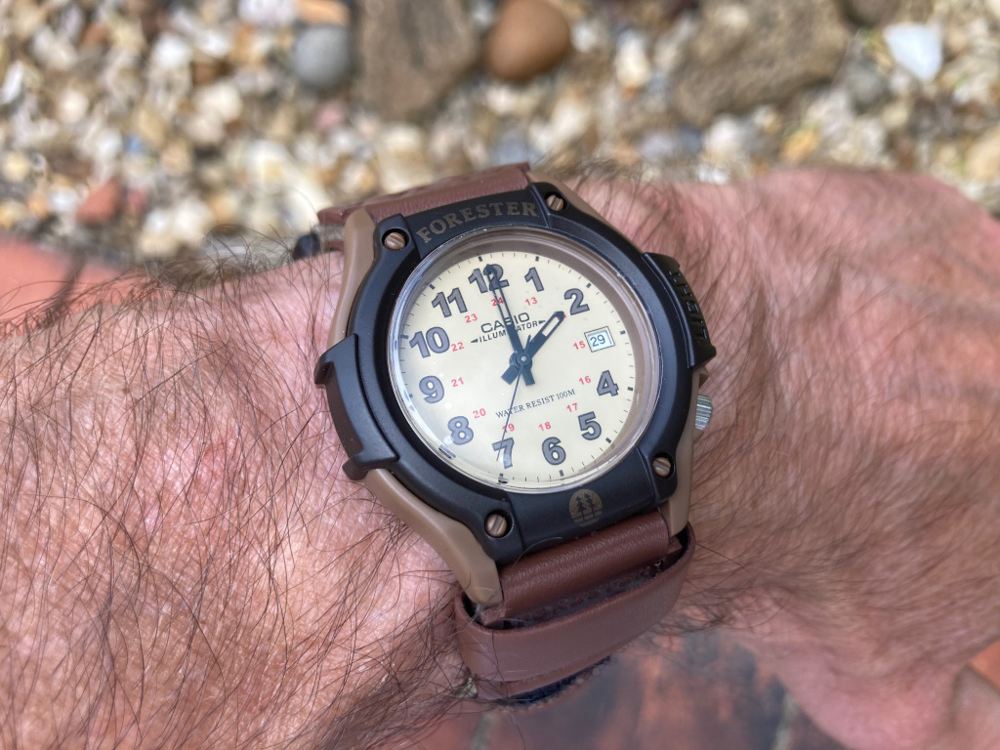

+++
title = "Casio Forester FT-500WC-5BVCF"
description = "description"
date = 2024-09-13
draft = true
[taxonomies]
tags = ["wristcheck", "casio"]
+++

{{ image_test(path="casio-forester.jpg", caption="caption") }}

<figure>
        
        <figcaption>Caption</figcaption>
</figure>

- Model: Casio Forester FT-500WC-5BVCF
- Case dia.: 41mm
- Movement: Quartz
- Water resistance: 100m
- Strap size: 20mm 
- Category: Field
- Price: £29.26 (RRP £31.13) 
- Available from: 

Comfortable, lightweight everyday wear and comes with a manual printed in a number of European languages. Not that there’s much to learn. May well become my gardening/everyday watch.

Battery SR920SW and CR1616, with a suggested lifetime of three years and replacing both at the same time. Backlit display. Elasticated textile strap with a velcro fastening.

Weight 27g.