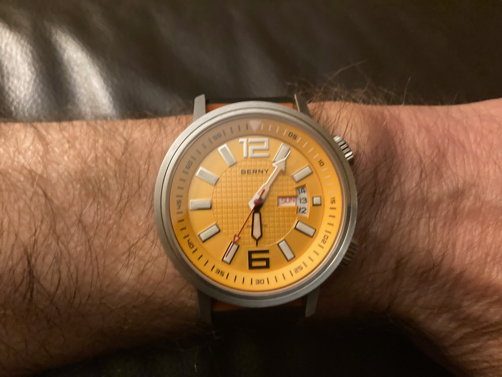
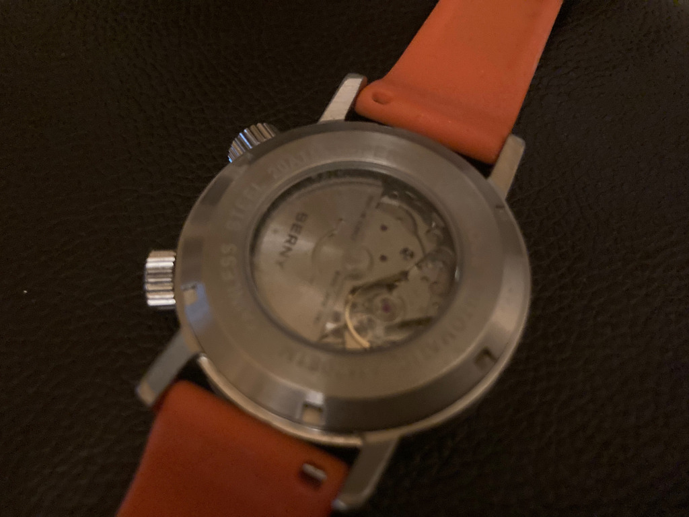
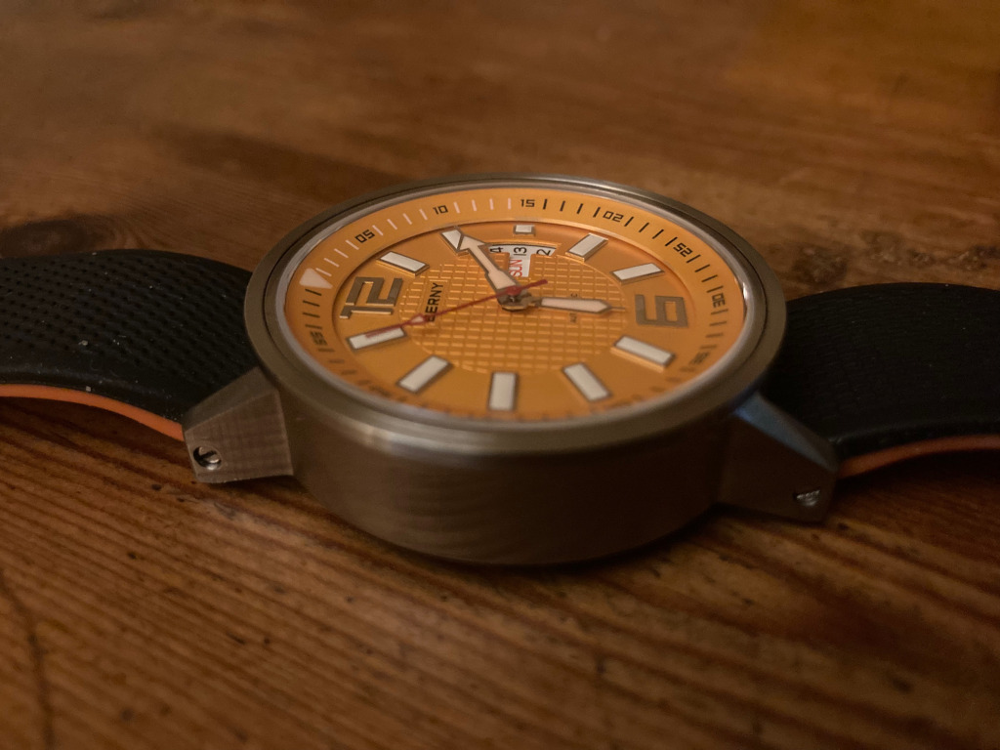

+++
title = "Berny Automatic Mechanical Dive AM7081M-YE watch"
description = "This dive watch from manufacturer Berny makes for an impressive and sizeable chunk of metal to adorn your wrist"
date = 2024-10-13
[taxonomies]
tags = ["wristcheck", "berny"]
+++

<figure>
        
        <figcaption>Berny’s Automatic Dive watch with its misaligned day mode</figcaption>
</figure>

- Model: Berny Automatic Mechanical Dive AM7081M-YE
- Case dia.: 42mm
- Movement: Miyota 8205 automatic 
- Water resistance: 200m
- Strap size: 20mm 
- Category: Dive
- Price: £67.50 (RRP £120.99) 
- Available from: [Berny](https://www.bernywatch.com/?ref=ihzqtbbh)

This watch from Berny is my first step away from a reliance on battery power that has endured since the 1980s when I had a watch made by Everite. As with the days of young adulthood that is but a distant memory.

My Everite was an old-fashioned wind-up watch. This one’s not. It’s automatic, with all its innards, including its Miyota 8205 movement, on show if you take a look at the rear (below). In case you were wondering, the differences between automatic and quartz are explained in this post by the [Watch Researcher](https://www.watchresearcher.com/quartz-vs-automatic-watch/).

But don’t make the same mistake I did and head to bed a couple of hours after the watch has arrived without first winding it up for 20 laps or so. I woke to find it had stopped, as you would expect if you had read the instructions first beforehand.

It’s is an impressive chunk of metal. There are 14mm of 316L stainless steel stacked up on your wrist in this 42mm case diameter watch. It’s almost as if the makers scooped out the chunk of metal and said,‘there, that’ll do’. And, yet, for all its depth, it weighs a mere 104g. It’s also protected by high-hardness sapphire glass and water-resistant to 200m.

<figure>
        
        <figcaption>All the innards are on view from the rear</figcaption>
</figure>

Luminescence is great, both at night and in low-light conditions, but the day/date setting, which feels a bit Heath Robinson if I’m honest, takes a while to get used to. This is visible in the main image, above. I still haven’t quite got the hang of it.

I replaced the strap supplied with one that fits my narrow wrist. And it fits like the first pair of shoes your mum bought from Clarkes (without the pain of breaking them in). The new strap is made by [Hemsut](https://amzn.to/3X9G54k), and comes in two sizes (both available in the package) to fit smaller and larger wrists.

<figure>
        
        <figcaption>14mm of stainless steel holds it aloft, away from the wrist</figcaption>
</figure>

If you’re wondering about the price I paid, that’s because I stepped away from Amazon, for once, and bought it direct from Berny. At the time they were having a summer sale, which, combined with my first-time buyer’s 10% discount, took a sizeable chunk off the RRP.