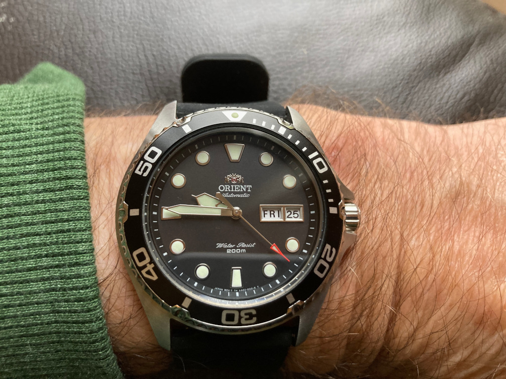

+++
title = "Orient diving watch FAA02007B9"
description = "It’s going to take something special for me to have to remove this diving watch from Japanese firm Orient from my wrist"
date = 2024-10-25
[taxonomies]
tags = ["wristcheck", "orient"]
+++

<figure>
        
        <figcaption>Orient’s automatic diving watch hits my sweet spot</figcaption>
</figure>

- Model: Orient diving watch FAA02007B9
- Case dia.: 41mm
- Movement: Automatic
- Water resistance: 200m
- Strap size: 20mm 
- Category: Diver
- Price: £148.33 
- Available from: [Amazon UK](https://amzn.to/4dWKNZu)

Sport, scuba diving, rough-and-tumble gear, elegant nightwear, this is a go-anywhere watch if ever there was one.

From one of the top three manufacturers of mechanical watches in Japan (now owned by Seiko), Orient’s automatic movement, which comes with this timepiece, is reliable and accurate from the moment you slip it over your wrist.

It was at this point that I started wondering why I didn’t just ditch most of my previous buys. This was, after all, the perfect watch. But then I wouldn’t be a collector, would I? For a collector, there is always something else out there, maybe just out of reach.

You know from the moment you put on a watch that that particular timepiece is not going anywhere for a considerable time. That’s the way I feel this particular watch makes me feel. Why change it? I’ve got no one to impress. And, even if I had, they would be impressed enough by this watch.

From its mineral crystal dome to the recently upgraded 120-click bezel, the 13mm by 41mm 316L stainless steel case, the smooth, sweeping second hand or the crown guard and the day/date function that adjusts with a reassuring click, this piece of automated Japanese wizardry is impressive by anyone’s standards.

What can I say, but it just feels right for me. Unlike some watches I’ve bought recently, the 41mm diameter casing feels at home on my wrist. Even the 42mm Rotary Seamatic (review pendi feels too big. Maybe I’ve found my sweet spot.

The one letdown is the rubber strap, which is not at great fit for my tiny wrist and has this awful overhang. So I’ve replaced it with an aftermarket one from Californian brand [Archers](https://amzn.to/3C0a480).