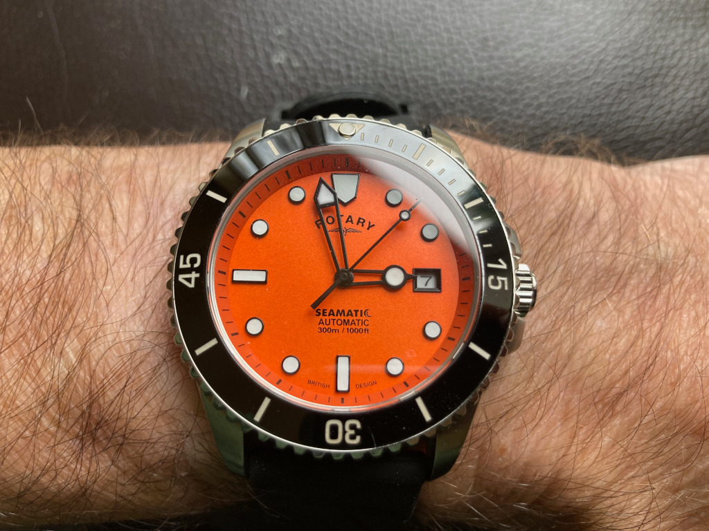
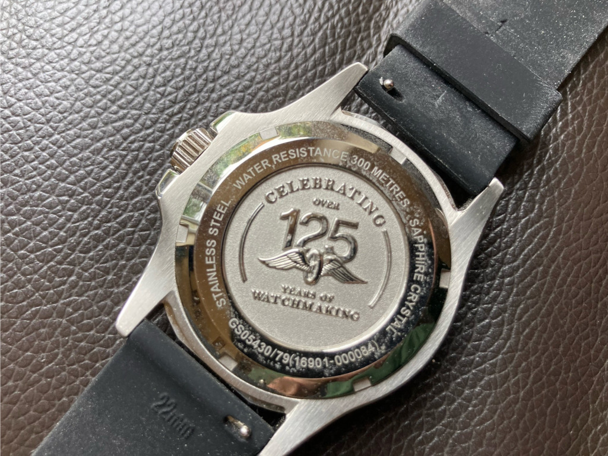

+++
title = "Rotary Seamatic Strap automatic watch, GS05430-79"
description = "The beautiful, near-perfect dive watch that doesn’t quite make the grade"
date = 2024-10-26
[taxonomies]
tags = ["wristcheck", "rotary"]
+++

<figure>
        
        <figcaption>Rotary Seamatic: the near-perfect watch that’s let down by a number of niggles</figcaption>
</figure>

- Model: Rotary Seamatic Strap automatic watch, GS05430/79
- Case dia.: 42mm
- Movement: Automatic
- Water resistance: 300m
- Strap size: 22mm, not 20mm 
- Category: Diver
- Price: £171.75 (RRP £229) 
- Available from: [Amazon UK](https://amzn.to/3XOJg2N)

I like the fact that it is automatic and powered by a Japanese Miyota 8215 movement, but let’s step back and look at this watch’s problems before I venture any further down the route of lavishing praise on this timepiece. And, it has to be said, most of the problems stem from ‘marketing people’ and their lack of attention to detail.

The strap doesn’t fit my skinny wrists so I had to buy a replacement. So I ordered one, not with the aid of a ruler, but based on its description. Then, when I came to fitting it, I noticed it did not take a 20mm band, as in Rotary’s description, but a 22mm one. Anyway, I bought a quick-release strap from [Archers](https://amzn.to/3ZwGVuE). Make that two, as there’s a lonely 20mm strap kicking around somewhere. Get with it, Rotary people. 

Meanwhile, its see-through hour/minute hands look good in daylight and low-light conditions but they work against its luminescence in the dark. Instead you get an hour hand that is visible and a minute hand that all but disappears if it’s over one of the indices. It wouldn’t have taken much forethought, or testing, to realise this, or to have painted the arms with their radioactive goodness so one could at least hazard a guess at the time through bleary, night-time eyes. Maybe this is not marketing’s fault but design and development, but it does not get away from the fact that they’re still ‘Rotary people’. 

And what’s with the name having ‘strap’ in it? Rotary Seamatic has a nice ring to it; Rotary Seamatic Strap, not so much. Marketing, methinks, is not something Rotary does well. At all.

<figure>
        
        <figcaption>Maybe the company’s 125th anniversary would have been a better focal point for Rotary’s marketing people</figcaption>
</figure>

Now that’s a fairly long list of niggles to have with a watch, but I still love it. So what do I like, you might ask? As with the [Ratio Freediver](/journal/watches/ratio-freediver-rtf-025), added to my collection in August, it has an orange dial, which I like a lot. So much, in fact, that there are now three watches with orange dials in my collection.

The fact that its case is made of 316L stainless steel. That its dial is adorned with a black ceramic unidirectional bezel and that it has a a crown guard to protect it from knocks. Oh, and the fact that it’s water-resistant right down to 300m, which should come in handy should I ever drop it in the bath.

But most of all, I like the fact that there’s no need for a battery. Unlike my Rotary Avenger Sport, which is not an automatic watch, as in Rotary’s description, but a quartz. Someone find the keys. Rotary’s marketing people are on the loose again…