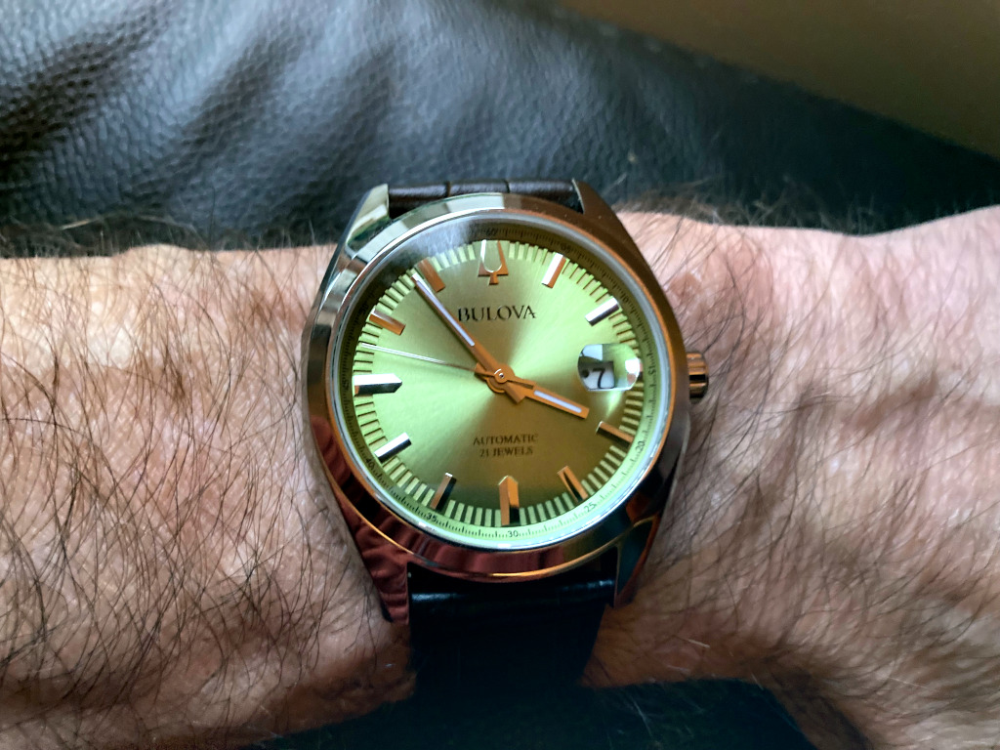

+++
title = "Bulova Surveyor 96B427"
description = "With its pistachio dial and sunburst finish, Bulova’s automatic Surveyor watch enjoys being the centre of attention"
date = 2024-11-07
[taxonomies]
tags = ["wristcheck", "bulova"]
+++

<figure>
        
        <figcaption>Bulova Surveyor: it’s striking pistachio dial may not be to everyone’s taste, but it suits mine. Shot on: Ricoh R10</figcaption>
</figure>

- Model: Bulova Surveyor 96B427
- Case dia.: 39mm
- Movement: Automatic
- Water resistance: 30m
- Strap size: 20mm
- Category: Dress
- Price: £219 (RRP £279)
- Available from: [Amazon UK](https://amzn.to/3YU0PPv)

Rabbit holes (distractions) have a habit of stopping you in your tracks. Delaying you to read something or go in search of anything to peel you away from the task you’d set out to do in the first place. The internet, despite its many uses, has a lot to answer for. So it was with Bulova.

As an immigrant to the US, Joseph Bulova set up the famous watchmaker in 1875. Interestingly, my venture down a rabbit hole, led me to discover at around the same time, in 1885, he was followed to New York by conscription-dodging German [Friedrich Trump](https://www.history.com/news/donald-trump-father-mother-ancestry), the grandfather of the newly elected US president, Donald ‘Ronny McD’ Trump. Where would the country be without immigrants finding their way to the US, I wonder? Anyway, Bulova celebrates its 150th year next season.

There is not a lot to dislike about Bulova’s Surveyor. Its silver-tone stainless steel case has sculpted edges and faceting, with polished and brushed finishing, a flat sapphire, scratch-resistant crystal, and a quick-release brown leather strap.

Alongside this the pistachio radiant dial has a sunburst finish, with silver-tone accents, hands with a luminescent fill, debossed minute markers, and a magnified date display. I don’t like the magnified date display, which, to my eye, distorts the date shown. That kind of defeats the object of having a magnified date window, wouldn’t you say? But I can live with that.

It is splash-resistant, no more, which is kind of odd when it has a depth allowance of 30m. That’s one hell of a splash. Quite frankly, it’s ludicrous that watchmakers are allowed to claim water-resistance levels far above what a watch is actually capable of. 

This automatic watch is powered by 21 jewels, which gives it a 42-hour power reserve when off the wrist. The movement itself is visible through the mineral crystal exhibition window on the caseback.

Bulova’s Surveyor has more than earned its place in my collection. It’s a keeper, in other words.